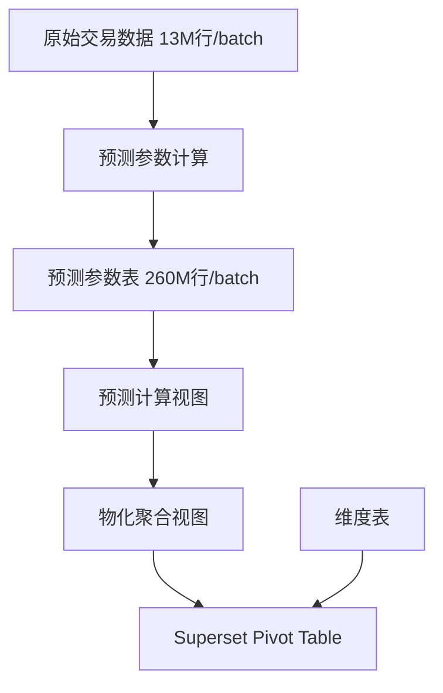

## 产品概述

针对大规模交易数据预测分析场景，构建高性能的ClickHouse数据模型和查询优化方案，解决千亿级预测数据的存储、导入和查询性能瓶颈。

## 核心需求

### 业务场景

- 基础数据：每batch约13M行交易数据，约90列不可分割，存储于ClickHouse
- 星型模型：join维度表（最大100W行，大部分10W行以内）
- 分析工具：Superset pivot table灵活分析

### 预测数据需求

- 生成60-70个月份的预测数据
- 每个月份最多20个指标
- 每个batch数据量：13M × 60 × 20 = 156亿行

### 性能瓶颈与目标

| 瓶颈 | 当前状态 | 目标要求 |
| --- | --- | --- |
| 导入时间 | >1小时 | <2分钟 |
| 查询时间 | >60s | <10s |
| 数据规模 | 10个batch过千亿行 | 可持续扩展 |


### 核心功能

1. **预测数据模型设计**：避免物理展开156亿行，采用参数化存储
2. **高效数据导入**：支持大规模预测数据的快速写入
3. **快速查询响应**：支持Superset pivot table的灵活多维分析
4. **存储优化**：控制数据膨胀，支持持续扩展

## 技术栈选择

- **数据存储**：ClickHouse ReplicatedMergeTree 系列引擎
- **数据建模**：参数化预测模型 + 物化视图 + 预聚合表
- **查询优化**：PREWHERE、跳数索引、分区裁剪、查询缓存
- **导入优化**：异步插入、并行写入、Native格式

## 核心技术方案

### 1. 预测数据建模策略

**关键思路：避免物理展开156亿行数据**

采用三层架构：

- **Layer 1 - 基础事实表**：存储原始13M行交易数据（已存在）
- **Layer 2 - 预测参数表**：存储预测模型参数（约260M行/batch = 13M × 20指标）
- **Layer 3 - 预测视图**：按需计算生成预测数据，不实际存储



### 2. 导入优化方案

**目标：156亿行等效数据导入 < 2分钟**

策略：

- **预测参数表导入**：260M行参数数据（减少99%数据量）
- **并行写入**：`max_insert_threads = 8`
- **异步插入**：`async_insert = 1`
- **Native格式**：使用ClickHouse Native格式传输

预估写入性能：

- 参数表260M行，使用并行+异步+压缩，预计30-60秒完成

### 3. 查询优化方案

**目标：查询响应 < 10秒**

策略：

- **物化视图预聚合**：按(batch_id, metric_id, month)预聚合
- **分区裁剪**：PARTITION BY (batch_id, metric_id)
- **排序键优化**：ORDER BY (batch_id, metric_id, prediction_month)
- **跳数索引**：为metric_id、prediction_month添加索引
- **查询缓存**：启用`use_query_cache = 1`
- **PREWHERE优化**：过滤条件前置

### 4. 存储优化方案

**目标：控制数据膨胀**

- **参数化存储**：260M行参数 vs 156亿行预测结果（减少99.8%存储）
- **TTL策略**：预测参数保留策略
- **压缩配置**：使用ZSTD压缩
- **分层存储**：热数据SSD，冷数据HDD

## 目录结构

```
14-use-case/
├── README.md                              # 预测数据场景总览和架构说明
├── 01_prediction_model.sql                # 预测数据建模 - 参数表、预测视图设计
├── 02_import_optimization.sql             # 导入优化 - 异步插入、并行写入示例
├── 03_query_optimization.sql              # 查询优化 - 物化视图、预聚合、索引设计
├── 04_superset_integration.sql            # Superset集成 - 视图、字典、UDF适配
└── 05_performance_benchmark.sql           # 性能基准测试 - 导入和查询性能验证
```

## 实现注意事项

### 性能关键点

1. **避免物理展开**：预测数据按需计算，不存储156亿行
2. **批量大小**：插入批次 ≥ 100,000行
3. **分区控制**：总分区数 < 1000
4. **索引数量**：跳数索引 < 10个

### 数据类型优化

- metric_id使用UInt8（最多20个指标）
- prediction_month使用UInt8（1-70）
- 参数值使用Float64或Decimal
- 避免Nullable，使用默认值

### 爆炸半径控制

- 使用独立数据库`prediction_analytics`
- 所有表使用ReplicatedMergeTree
- 预测视图添加`SETTINGS max_rows_to_read = 100000000`